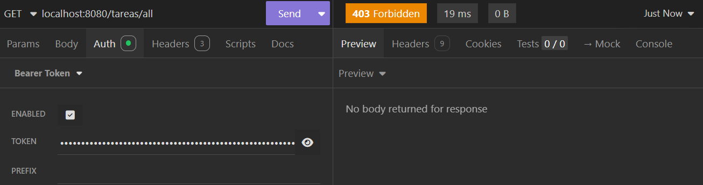
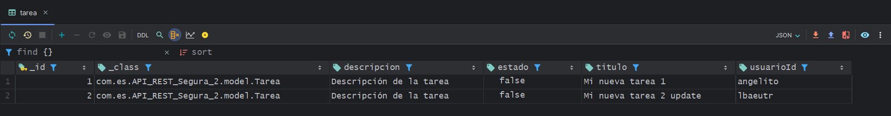

# PRUEBAS GESTIÓN DE TAREAS

Este documento contiene las pruebas realizadas para los **endpoints de gestión de tareas** en la API REST. Incluye los casos de uso, ejemplos de peticiones, respuestas esperadas y códigos de estado.

---


## 1. Endpoints de gestión de tareas (USER)

### 1.1. Crear tarea

- **Endpoint:** `POST /tareas`
- **Descripción:** Un usuario autenticado puede crear una tarea para sí mismo.
- **Código de respuesta esperado:**

    - **201 CREATED** - La tarea se ha creado correctamente.
    - **400 BAD REQUEST** - La petición no es válida.
    - **401 UNAUTHORIZED** - El usuario no está autenticado.
    - **403 FORBIDDEN** - El usuario no tiene permisos para crear la tarea.
    - **404 NOT FOUND** - El usuario no existe.

- **Ejemplo de petición:**

    ```json
    {
      "titulo": "Comprar pan",
      "descripcion": "Tengo que comprar pan para la BBQ"
    }
    ```
  
- **Ejemplo de respuesta:**

    ```json
    {
      "_id": "7",
      "titulo": "Comprar pan",
      "descripcion": "Tengo que comprar pan para la BBQ",
      "estado": false,
      "usuarioId": "diego"
    }
    ```
  


- **Captura de pantalla:**
    - **Código de respuesta esperado:** `201 Created`


---

#### Crear tarea sin autenticación

- **Endpoint:** `POST /tareas`
- **Descripción:** Un usuario sin auntenticar no puede crear una tarea.

- **Ejemplo de petición:**

    ```json
    {
       "titulo": "Comprar pan",
       "descripcion": "Tengo que comprar pan para la BBQ"
    }
    ```


- **Captura de pantalla:**
  - **Código de respuesta esperado:** `401 Unauthorized`


---

#### Crear tarea con datos vacios

Este caso de prueba verifica que no se pueda crear una tarea con datos vacíos, ya sea con un solo campo o con ambos.

- **Ejemplo de petición:**

    ```json
    {
      "titulo": "",
      "descripcion": ""
    }
    ```

- **Ejemplo de respuesta (error):**

    ```json
    {
      "message": "Bad Request Exception (400). El título y la descripción no pueden estar vacíos",
      "uri": "/tareas"
    }
    ```


- **Captura de pantalla:**
  - **Código de respuesta esperado:** `400 Bad Request`


---


### 1.2. Listar tareas


- **Endpoint:** `Get /tareas/{id}`
- **Descripción:** Un usuario autenticado puede listar sus tareas por id.

- **Ejemplo de respuesta:**

    ```json
    {
      "_id": "7",
      "titulo": "Comprar pan",
      "descripcion": "Tengo que comprar pan para la BBQ",
      "estado": false,
      "usuarioId": "diego"
    }
    ```


- **Captura de pantalla:**
  - **Código de respuesta esperado:** `200 OK`


---

#### Listar tareas que pertenecen a otro usuario

- **Endpoint:** `Get /tareas/{id}`
- **Descripción:** Un usuario intenta listar las tareas de otro usuario.

- **Captura de pantalla:**
  - **Código de respuesta esperado:** `401 Unauthorized`


---

#### Listar tareas sin autenticación

- **Endpoint:** `Get /tareas/{id}`
- **Descripción:** Un usuario no autenticado no puede listar sus tareas.

- **Captura de pantalla:**
  - **Código de respuesta esperado:** `401 Unauthorized`


---

### 1.3. Actualizar tarea


- **Endpoint:** `Get /tareas/{id}`
- **Descripción:** Un usuario autenticado puede actualizar una tarea por id.


- **Captura de pantalla antes de la actualización**


En este caso se actualiza tanto la descripción como el estado de la tarea.

- **Ejemplo de petición:**

    ```json
    {
      "titulo": "Comprar pan",
      "descripcion": "Tengo que comprar pan para la BBQ y para casa de mi madre",
      "estado": true
    }
    ```


- **Ejemplo de respuesta:**

    ```json
    {
      "_id": "7",
      "titulo": "Comprar pan",
      "descripcion": "Tengo que comprar pan para la BBQ y para casa de mi madre",
      "estado": true,
      "usuarioId": "diego"
    }
    ```


- **Captura de pantalla:**
  - **Código de respuesta esperado:** `200 OK`


---

#### Actualizar tarea sin autenticación

- **Endpoint:** `Get /tareas/{id}`
- **Descripción:** Un usuario no autenticado no puede actualizar una tarea.


- **Ejemplo de petición:**

    ```json
    {
      "titulo": "Comprar pan",
      "descripcion": "Tengo que comprar pan para la BBQ y para casa de mi madre y resto de personas del instituto",
      "estado": true
    }
    ```


- **Captura de pantalla:**
  - **Código de respuesta esperado:** `401  Unauthorized`


---

#### Actualizar tarea de otro usuario

- **Endpoint:** `Get /tareas/{id}`
- **Descripción:** Un usuario no puede actualizar una tarea de otro usuario.


- **Ejemplo de petición:**

    ```json
    {
      "titulo": "Comprar pan",
      "descripcion": "Tengo que comprar pan para la BBQ y para casa de mi madre y resto de personas del instituto",
      "estado": true
    }
    ```


- **Captura de pantalla:**
  - **Código de respuesta esperado:** `401  Unauthorized`


---

#### Actualizar tarea con datos vacíos

- **Endpoint:** `Get /tareas/{id}`
- **Descripción:** Un usuario no puede actualizar una tarea con datos vacíos.


Este caso de prueba verifica que no se pueda actualizar una tarea con datos vacíos, ya sea con un solo campo o con ambos.


- **Ejemplo de petición:**

    ```json
    {
      "titulo": "",
      "descripcion": "",
      "estado": true
    }
    ```
  
- **Ejemplo de respuesta (error):**

    ```json
    {
      "message": "Bad Request Exception (400). El título y la descripción no pueden estar vacíos",
      "uri": "/tareas/7"
    }
    ```
  
- **Captura de pantalla:**
- **Código de respuesta esperado:** `400 Bad Request`


---

#### Actualizar tarea con id no existente

- **Endpoint:** `Get /tareas/{id}`
- **Descripción:** Un usuario no puede actualizar una tarea con un id que no existe.

En este caso se intenta actualizar una tarea con un id que no existe en la base de datos.

-**Ejemplo de peticion:**

```json
{
  "titulo": "Comprar pan",
  "descripcion": "Tengo que comprar pan para la BBQ y para casa de mi madre y resto de personas del instituto",
  "estado": true
}
```

- **Captura de pantalla:**
  - **Código de respuesta esperado:** `400 Bad Request`


---

### 1.4. Eliminar tarea

- **Endpoint:** `DELETE /tareas/{id}`
- **Descripción:** Un usuario autenticado puede eliminar una tarea por id.

- **Captura de pantalla antes de la actualización**


- **Captura de pantalla:**
    - **Código de respuesta esperado:** `204 No Content`


---

#### Eliminar tarea sin autenticación

- **Endpoint:** `DELETE /tareas/{id}`
- **Descripción:** Un usuario no autenticado no puede eliminar una tarea.
- **Captura de pantalla:**
    - **Código de respuesta esperado:** `401 Unauthorized`


---

#### Eliminar tarea de otro usuario

- **Endpoint:** `DELETE /tareas/{id}`
- **Descripción:** Un usuario no puede eliminar una tarea de otro usuario.


- **Captura de pantalla:**
    - **Código de respuesta esperado:** `401 Unauthorized`


---

#### Eliminar tarea con id no existente

- **Endpoint:** `DELETE /tareas/{id}`
- **Descripción:** Un usuario no puede eliminar una tarea con un id que no existe.
- **Captura de pantalla:**
    - **Código de respuesta esperado:** `400 Bad Request`


---


## 2. Endpoints de gestión de tareas (ADMIN)

### 2.1. Listar tareas

- **Endpoint:** `Get /tareas/all`
- **Descripción:** Un usuario autenticado con rol de administrador puede listar todas las tareas.
- **Código de respuesta esperado:**

    - **200 OK** - La lista de tareas se ha obtenido correctamente.
    - **401 UNAUTHORIZED** - El usuario no está autenticado.
    - **403 FORBIDDEN** - El usuario no tiene permisos para listar las tareas.


Para este caso de prueba se ha utilizado un usuario con rol de administrador(lbaeutr).


- **Captura de pantalla BBDD con los usuarios existentes**


- **Ejemplo de respuesta:**

    ```json
   [
	{
		"_id": "1",
		"titulo": "Mi nueva tarea 1",
		"descripcion": "Descripción de la tarea",
		"estado": false,
		"usuarioId": "angelito"
	},
	{
		"_id": "2",
		"titulo": "Mi nueva tarea 2 update",
		"descripcion": "Descripción de la tarea",
		"estado": false,
		"usuarioId": "lbaeutr"
	},
	{
		"_id": "4",
		"titulo": "Segunda tarea",
		"descripcion": "Descripción de la tarea",
		"estado": true,
		"usuarioId": "diego"
}
]
    ```
  

- **Captura de pantalla:**
  - **Código de respuesta esperado:** `200 OK`


---

#### Listar tareas sin autenticación


- **Endpoint:** `Get /tareas/all`
- **Descripción:** Un usuario no autenticado no puede listar todas las tareas.

- **Captura de pantalla:**
  - **Código de respuesta esperado:** `401 Unauthorized`


---

#### Listar tareas con rol USER

Para este ejemplo se ha utilizado un usuario con rol de usuario (diego).


- **Endpoint:** `Get /tareas/all`
- **Descripción:** Un usuario con rol de usuario no puede listar todas las tareas.
- **Captura de pantalla:**
  - **Código de respuesta esperado:** `403 Forbidden`



---


### 2.2. Eliminar cualquier tarea con rol de administrador

- **Endpoint:** `DELETE /tareas/admin/{id}`
- **Descripción:** Un usuario autenticado con rol de administrador puede eliminar cualquier tarea por id.

Para este caso de prueba se ha utilizado un usuario con rol de administrador(lbaeutr) y se ha eliminado la tarea con id 5.


- **Captura de pantalla BBDD con las tareas existentes**


- **Captura de pantalla:**
  - **Código de respuesta esperado:** `204 No Content`


- **Captura de pantalla BBDD con las tareas existentes después de eliminación**




---

#### Eliminar cualquier tarea sin autenticación 

- **Endpoint:** `DELETE /tareas/admin/{id}`
- **Descripción:** Un usuario no autenticado no puede eliminar cualquier tarea por id.
- **Captura de pantalla:**
  - **Código de respuesta esperado:** `401 Unauthorized`
  


---

#### Eliminar cualquier tarea con rol USER

Para este ejemplo se ha utilizado un usuario con rol de usuario (diego).


- **Endpoint:** `DELETE /tareas/admin/{id}`
- **Descripción:** Un usuario con rol de usuario no puede eliminar cualquier tarea por id.
- **Captura de pantalla:**
  - **Código de respuesta esperado:** `403 Forbidden`


---

#### Eliminar cualquier tarea con id no existente

- **Endpoint:** `DELETE /tareas/admin/{id}`
- **Descripción:** Un usuario con rol de administrador no puede eliminar una tarea con un id que no existe.
- **Captura de pantalla:**
  - **Código de respuesta esperado:** `400 Bad Request`


---


### 2.3. Dar alta a cualquier tarea con rol de administrador para un usuario

- **Endpoint:** `POST /tareas/admin?usuarioId={usuarioId}`
- **Descripción:** Un usuario autenticado con rol de administrador puede dar de alta una tarea para cualquier usuario.
- **Código de respuesta esperado:**

    - **201 CREATED** - La tarea se ha creado correctamente.
    - **400 BAD REQUEST** - La petición no es válida.
    - **401 UNAUTHORIZED** - El usuario no está autenticado.
    - **403 FORBIDDEN** - El usuario no tiene permisos para crear la tarea.
    - **404 NOT FOUND** - El usuario no existe.


Para este caso de prueba se ha utilizado un usuario con rol de administrador(lbaeutr) y se ha creado una tarea para el usuario (diego).


  - **Ejemplo de petición:**

    ```json
    {
      "titulo": "Tarea para diego",
      "descripcion": "Descripción de la tarea"
    }
    ```
    
- **Ejemplo de respuesta:**

    ```json
    {
	  "_id": "3",
	  "titulo": "Tarea para diego",
	  "descripcion": "Descripción de la tarea",
	  "estado": false,
	  "usuarioId": "diego"
    }
    ```

- **Captura de pantalla:**
  - **Código de respuesta esperado:** `201 Created`


---

#### Dar alta a cualquier tarea sin autenticación

- **Endpoint:** `POST /tareas/admin?usuarioId={usuarioId}`
- **Descripción:** Un usuario no autenticado no puede dar de alta una tarea para cualquier usuario.


- **Captura de pantalla:**
  - **Código de respuesta esperado:** `401 Unauthorized`


---


#### Dar alta a cualquier tarea con rol USER

Para este ejemplo se ha utilizado un usuario con rol de usuario (diego) y creado una tarea para el usuario (lbaeutr).


- **Endpoint:** `POST /tareas/admin?usuarioId={usuarioId}`
- **Descripción:** Un usuario con rol de usuario no puede dar de alta una tarea para cualquier usuario.
- **Captura de pantalla:**
  - **Código de respuesta esperado:** `403 Forbidden`


---


#### Dar alta a cualquier tarea con datos vacíos

- **Endpoint:** `POST /tareas/admin?usuarioId={usuarioId}`
- **Descripción:** Un usuario con rol de administrador no puede dar de alta una tarea con datos vacíos, ya sea con un solo campo o con ambos.

- **Ejemplo de petición:**

  ```json
  {
    "titulo": "",
    "descripcion": ""
  }
  ```
    
- **Ejemplo de respuesta (error):**

  ```json
  {
    "message": "Bad Request Exception (400). El título y la descripción no pueden estar vacíos",
    "uri": "/tareas/admin"
  }
    ```
- **Captura de pantalla:**
  - **Código de respuesta esperado:** `400 Bad Request`


---

#### Dar alta a cualquier tarea con usuario no existente

- **Endpoint:** `POST /tareas/admin?usuarioId={usuarioId}`
- **Descripción:** Un usuario con rol de administrador no puede dar de alta una tarea para un usuario que no existe.
  - **Captura de pantalla:**
    - **Código de respuesta esperado:** `400 Bad Request`

- **Ejemplo de respuesta (error):**

  ```json
  {
    "message": "Bad Request Exception (400). Usuario no encontrado en la BBDD",
    "uri": "/tareas/admin"
  }
  ```


---


## Documentación extra

### **Vídeo funcionamiento interfaz**


<a href="https://www.canva.com/design/DAGgN8_A-Uc/E1m-NTSSqsAjB3VeGuzeLA/watch?utm_content=DAGgN8_A-Uc&utm_campaign=designshare&utm_medium=link2&utm_source=uniquelinks&utlId=h100348045b"></a>

